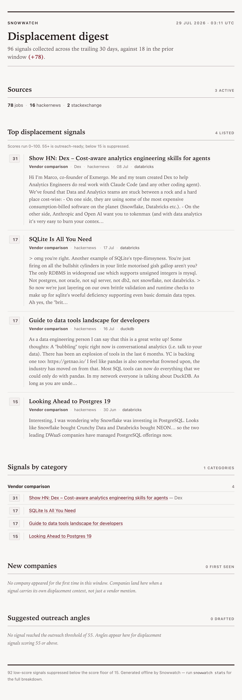

# snowwatch

A competitive displacement signal monitor. Snowwatch tracks public signals of
Snowflake customer pain — cost complaints, migration chatter, performance gripes,
vendor comparisons — and rolls them into a weekly digest built for sales
outreach targeting.

It runs entirely offline after collection: no LLM calls, no paid APIs, no
browser automation. Storage is a single SQLite file.

## Why displacement signals matter for GTM

The best time to reach a prospect is when they are already unhappy with what they
have. Someone publicly complaining that their Snowflake bill doubled, or posting
a "migrating off Snowflake" job req, is a warmer lead than any cold list. These
signals surface in the open — Hacker News threads, subreddit posts, job
descriptions — but they are scattered and decay fast.

Snowwatch aggregates them, scores intent, tags the type of pain, and hands sales
a ranked list with a suggested angle for each high-score account. Instead of
spraying a segment, reps work a short list of people who just told the internet
they have the exact problem you solve.

## Data sources

- **Hacker News** via the public Algolia API (`hn.algolia.com/api`). Searches
  comments and stories for the configured cost/migration terms.
- **Reddit** across r/dataengineering, r/snowflake, and r/databricks. Two modes,
  chosen automatically and logged at run time:
  - **Authenticated** (preferred): set `REDDIT_CLIENT_ID` and
    `REDDIT_CLIENT_SECRET` to use the official OAuth API (client-credentials
    flow, token cached until expiry, rate-limit headers honored). See
    [Reddit setup](#reddit-setup).
  - **Public fallback**: with no credentials it uses the public `.json` search
    endpoints with a descriptive User-Agent and a courtesy delay. Many
    datacenter/cloud IPs get a 403 here; when that happens the source is logged
    and skipped and the rest of the run continues.
- **Job postings** via a pluggable `JobSource`. With no credentials it uses an
  offline stub so the pipeline always runs. Set `ADZUNA_APP_ID` and
  `ADZUNA_APP_KEY` in the environment to switch to live Adzuna data
  automatically — see [Adding a job API key](#adding-a-job-api-key).

If any single source fails, snowwatch logs the error and continues with the
others.

## Setup

```bash
python3 -m venv .venv
source .venv/bin/activate
pip install -e ".[dev]"
```

Requires Python 3.11+.

Optional credentials unlock the authenticated Reddit API and live job postings.
Copy `.env.example` to `.env`, fill in what you have, and export it before
running (`set -a; source .env; set +a`). Everything runs without credentials —
Reddit falls back to the public endpoints and jobs use an offline stub.

| Variable                | Enables                                  |
|-------------------------|------------------------------------------|
| `REDDIT_CLIENT_ID`      | Reddit OAuth API (avoids the 403 fallback) |
| `REDDIT_CLIENT_SECRET`  | "                                        |
| `ADZUNA_APP_ID`         | Live Adzuna job postings                 |
| `ADZUNA_APP_KEY`        | "                                        |

## Usage

```bash
snowwatch collect      # run all collectors, store new signals
snowwatch digest       # render the trailing-7-day digest (markdown + HTML)
snowwatch stats        # counts by source, category, and week
snowwatch run          # collect + digest in one shot
```

Common options:

```bash
snowwatch collect --db signals.db
snowwatch digest --days 14 --out digests
```

Digests are written to `digests/digest-YYYYMMDD.md` and `.html`.

## Sample digest

The digest opens with a source summary and a week-over-week trend line, then top
signals ranked by score (displacement categories only), the same signals grouped
by category, new companies detected in the window, and a tailored outreach angle
for every high-score displacement signal.



*The HTML digest is a self-contained styled page; score badges turn orange above
the outreach threshold. Generate one with `snowwatch digest` and drop a
screenshot at `docs/digest-sample.png`.*

```
# Snowwatch Weekly Digest
Generated 2026-07-20 18:10 UTC · trailing 7 days · 5 signals
Trend: 5 this period vs 3 prior (+2)

## Top signals by score
1. [97] MIGRATION_INTENT — Senior Data Engineer — Snowflake Migration
   Company: Northwind Analytics · Source: jobs · 2026-07-18
   > We are replatforming off Snowflake to reduce compute cost...
2. [65] COST_PAIN — Analytics Engineer (Cost Optimization Snowflake)
   Company: Brightloom Inc · Source: jobs · 2026-07-15
   > Our Snowflake bill is growing fast...
```

## How scoring works

Scoring is rule-based and lives in `scoring.py`; the weights and phrase lists
live in `config.py` so they are editable without touching logic. Each signal
starts at zero and accrues points:

| Contribution            | Points | Trigger                                    |
|-------------------------|--------|--------------------------------------------|
| Migration intent        | 45     | "migrating off snowflake", "replatform"... |
| Cost pain               | 30     | "snowflake bill", "too expensive"...       |
| Performance complaint   | 18     | "slow query", "warehouse is slow"...       |
| Vendor comparison       | 15     | "databricks", "vs snowflake"...            |
| General negativity      | 8      | "frustrated", "nightmare", "regret"...     |
| Company detected        | 12     | an org name extracted from the text        |
| Recency bonus           | 0–10   | full for ≤3 days old, tapering to 14 days  |
| Engagement bonus        | 0–8    | upvotes + comments on the source post      |

The buckets are additive and the total is capped at 100, so explicit migration
intent outranks cost complaints, which outrank softer negativity — matching how
a rep would prioritize the list.

**Direction and sentiment guards.** Before points are awarded, `analyze()`
checks direction and tone. Inbound phrases ("migrating to snowflake", "switched
to snowflake") without an explicit outbound phrase drop the migration bucket and
apply a penalty, so people *adopting* Snowflake do not read as displacement.
Positive-context phrases ("snowflake is great", "pricing is fair") suppress the
cost, performance, and negativity buckets so satisfied mentions do not score as
pain. Both lists live in `config.py`.

**Company extraction** uses confidence tiers. Tier one is explicit context —
`we at X`, `X's data team`, `at X`, or a legal suffix (`X Inc`) — and counts on
a single match. Tier two is bare capitalization, which must recur (2+ times) in
the same signal before it is trusted. A denylist of tech/vendor terms (AWS, DBT,
Databricks, Snowflake itself, ...) and common capitalized words is rejected at
every tier. Display names are preserved; `normalize_company` strips suffixes and
whitespace only for dedupe.

**Classification** (`classifier.py`) assigns exactly one category per signal —
`MIGRATION_INTENT`, `COST_PAIN`, `PERFORMANCE_COMPLAINT`, `VENDOR_COMPARISON`,
`MIGRATION_INBOUND`, or `OTHER` — resolved in priority order so the strongest
buy-signal wins. `MIGRATION_INBOUND` stays visible in `stats` but is excluded
from the digest's top signals and outreach.

**Outreach angles** are template-based, keyed off the category. Cost pain maps
to a TCO comparison, migration intent to a migration-accelerator offer, and so
on. See `OUTREACH_ANGLES` in `digest.py`.

## Known limitations and scoring notes

**Rule-based tradeoffs.** Scoring is deterministic phrase matching, not
comprehension. It is fully offline, fast, and auditable, and it never
hallucinates — but it misses paraphrases the phrase lists do not cover and can
over-credit a signal that stacks keywords without real intent. Tune the lists
and weights in `config.py` as your corpus teaches you what fires.

**Direction detection.** Inbound versus outbound migration is decided by
explicit directional phrases, with outbound winning ties. This catches the
common "moving to/off snowflake" forms but not every rephrasing; an ambiguous
"snowflake migration" with no direction word is treated as outbound intent,
which biases toward surfacing rather than hiding a possible signal.

**Company confidence.** Extraction is heuristic. Explicit context is reliable;
bare capitalization requires repetition and still yields the occasional false
name or misses a lowercase-styled brand. Treat the company field as a lead, not
ground truth, and expect the denylist to need occasional additions.

**Reddit auth modes.** With credentials the OAuth API is stable and rate-limit
aware. Without them the public `.json` fallback works from residential IPs but
returns 403 from many cloud/datacenter IPs; that failure is logged and skipped,
so a keyless run in the cloud simply collects no Reddit signals.

## Reddit setup

Authenticated Reddit access takes about two minutes and avoids the public-endpoint
403s:

1. Go to <https://www.reddit.com/prefs/apps> and create an app of type
   **script**. Any name works; set the redirect URI to `http://localhost`.
2. Copy the client id (under the app name) and the secret.
3. Export them before running:

   ```bash
   export REDDIT_CLIENT_ID=your_id
   export REDDIT_CLIENT_SECRET=your_secret
   snowwatch collect
   ```

The collector logs `reddit: using authenticated OAuth API` when the credentials
are picked up, or `reddit: no credentials, using public .json fallback` otherwise.

## Adding a job API key

The default `StubJobSource` keeps the pipeline runnable with no keys. To pull
live postings from [Adzuna](https://developer.adzuna.com/) (free tier):

1. Register for an app id and key.
2. Export them before running:

   ```bash
   export ADZUNA_APP_ID=your_id
   export ADZUNA_APP_KEY=your_key
   snowwatch collect
   ```

`default_job_source()` detects the variables and switches to `AdzunaJobSource`
automatically. To add a different provider, implement the `JobSource` protocol
(`fetch(client, terms) -> list[Signal]`) in `collectors/jobs.py` and return it
from `default_job_source()`.

## Configuration

Edit `snowwatch/config.py` to change query terms, subreddits, scoring weights,
the phrase buckets, request delays, and the digest window. No other file needs
to change for tuning.

## Tests

```bash
pytest
```

Covers scoring order and bounds, company extraction, dedupe, classification, and
digest rendering against fixture data.

## Project layout

```
snowwatch/
  config.py         query terms, weights, phrase buckets
  models.py         Signal dataclass + url hashing
  collectors/       one collector per source + pluggable JobSource
  scoring.py        rule-based score + company extraction
  classifier.py     single-category tagging
  db.py             SQLite storage, dedupe, queries
  digest.py         digest assembly + outreach angles
  pipeline.py       collect -> enrich -> store orchestration
  cli.py            Typer commands
templates/          markdown + HTML digest templates
tests/              pytest suite with fixtures
```

See [ARCHITECTURE.md](ARCHITECTURE.md) for the data-flow diagram and a guide to
adding a new collector.
